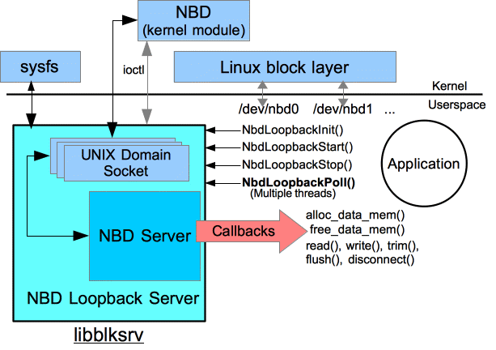

# blksrv
*blksrv* is a library (*libblksrv*) which allows you to create a kernel block device whose data is served by your C++ application. It uses Linux kernel's *nbd* driver to achieve the same. More information on *nbd* can be found on [nbd's sourceforge page](https://nbd.sourceforge.io/).



Applications can create multiple nbd devices by calling ```NbdLoopbackStart(...)``` multiple times. Also different processes can use *libblksrv* at the same time without creating any nbd instance conflict.

*libblksrv* allows for zero copy implementations by letting the application provide the data buffers for both read and write. Before each read/write callback, the library calls ```alloc_data_mem()``` callback to allocate the buffer. For write() this buffer will be loaded with the data before the write() callback is made to the application. Same is for read, this buffer will be passed to the app to fill in the data. e.g. This allows for using the pre-allocated DMA memory for SPDK based applications.

*libblksrv* also implements user controlled polling. Application calls ```NbdLoopbackPoll()``` to get the server to process incoming requests and do the callbacks. Multiple threads can call ```NbdLoopbackPoll()``` simultenously to achieve better performance.

## How to use libblksrv in your applications
- Compile *libblksrv* by typing _make_ in the root diretory of this workspace.
- Make sure to include the path to *nbd_server.h* and *nbd_loopback_server.h* in your project and add the *libblksrv.a* to your project.
- ```#include <nbd_loopback_server.h>``` in the source file where you will call *libblksrv*.
- Call ```NbdLoopbackInit()``` in the beginning of your project. Make sure the return code is 0 (refer to header file for details).
- Implement the callbacks (see below for details on callbacks).
- When you need an nbd block device in your project, instantiate an ```NbdParams``` struct, initialize it and call ```NbdLoopbackStart(...)```. See ramdisk example for details.
- When a specific nbd block device is no longer needed, application calls ```NbdLoopbackStop(...)``` and passes the given nbd device string to it to remove that device from the system. Application can (optionally) also specify a disconnect() callback which will be called before the nbd device is taken away.
- 
